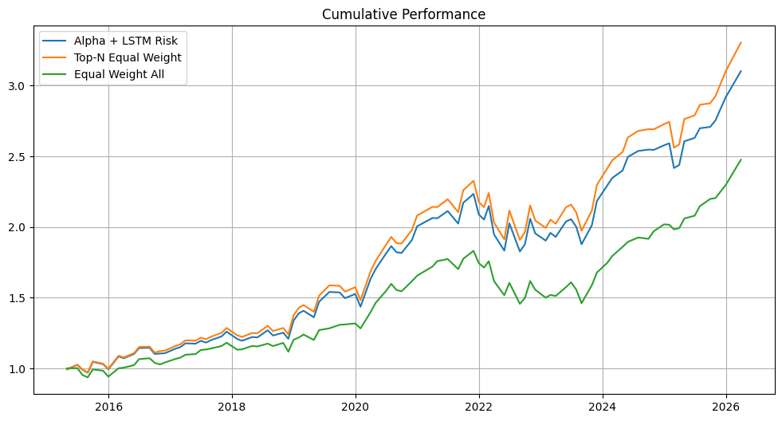
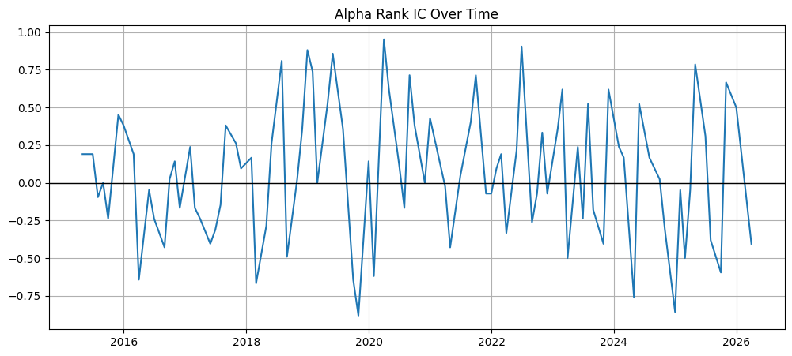
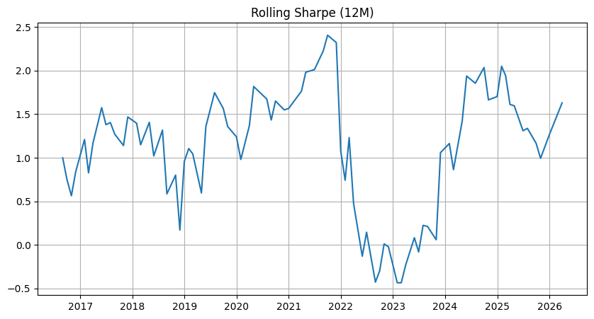
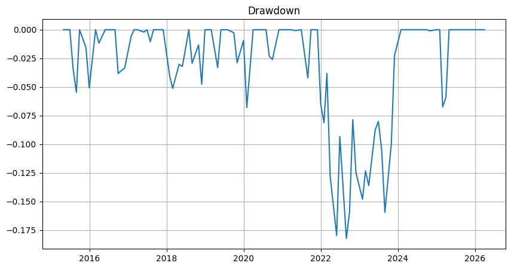

# ML + Deep Learning Multi-Asset Trading Strategy

## Overview

This project develops a systematic multi-asset trading strategy combining:

* Machine Learning (Random Forest) for return prediction
* Deep Learning (LSTM) for volatility forecasting
* Risk-adjusted portfolio construction

The objective is to **allocate capital dynamically across assets** by balancing expected return and predicted risk.

## Asset Universe

The strategy is implemented on a diversified set of liquid ETFs representing major asset classes:

* **Equities:** SPY (S&P 500), QQQ (Nasdaq 100), IWM (Russell 2000), EFA (Developed Markets), EEM (Emerging Markets)
* **Fixed Income:** TLT (Long-Term Treasury Bonds)
* **Commodities:** GLD (Gold)
* **Real Estate:** VNQ (REITs)

### Rationale

* Provides exposure across **global equities, rates, commodities, and real estate**
* Ensures **liquidity and tradability**
* Allows the model to learn **cross-asset relationships and diversification effects**

This multi-asset setup enables the strategy to capture **relative value opportunities across asset classes**, rather than relying on a single market.

## Model Architecture

The strategy combines two models with distinct roles:

---

### Alpha Model — Return Prediction

* **Model:** Random Forest Regressor
* **Input:** Cross-sectional features (momentum, volatility, skewness, mean-reversion signals)
* **Output:** Predicted 21-day forward return for each asset

**Key Characteristics:**

* Captures nonlinear relationships between features and returns
* Robust to noise and overfitting due to ensemble averaging
* Used for **ranking assets cross-sectionally**

---

### Risk Model — Volatility Forecasting

* **Model:** Long Short-Term Memory (LSTM) Neural Network
* **Input:** Sequences of past features (20-day window)
* **Output:** Predicted future realized volatility

**Why LSTM:**

* Captures **temporal dependencies** in financial time series
* Learns patterns such as:

  * Volatility clustering
  * Market regime shifts
  * Nonlinear dynamics

---

### Combined Signal

The final portfolio weights are determined by combining both models:

Weight ∝ Expected Return ÷ Risk

This results in:

* Higher allocation to assets with **strong expected returns**
* Lower exposure to assets with **high predicted risk**

---

### Training Framework

* Walk-forward training (no look-ahead bias)
* Models retrained at each rebalance step using historical data
* Strict out-of-sample evaluation

---

### Key Insight

While the alpha model demonstrates consistent predictive power, the volatility model primarily improves **risk control**, with limited impact on overall return enhancement.

---

## Strategy Architecture

The strategy follows a standard quantitative investment pipeline:

### 1. Feature Engineering

* Momentum (5d, 21d, 63d)
* Volatility and downside risk
* Mean-reversion signals (moving average gaps)
* Standardized return (z-score)

---

### 2. Alpha Model (Return Prediction)

* Random Forest regression
* Cross-sectional prediction across assets
* Assets ranked by predicted return

---

### 3. Risk Model (Volatility Forecasting)

* LSTM neural network
* Sequence-based learning from historical features
* Captures volatility clustering and regime shifts

---

### 4. Portfolio Construction

* Long top-ranked assets
* Position sizing based on:

[
\text{Weight} \propto \frac{\text{Predicted Return}}{\text{Predicted Volatility}}
]

* Weight clipping and normalization
* Transaction cost adjustment

---

### 5. Backtesting Framework

* Walk-forward (rolling) training and testing
* Monthly rebalancing
* Strict out-of-sample evaluation

---

## Results

| Metric            | Strategy |
| ----------------- | -------- |
| Annual Return     | 15.73%   |
| Annual Volatility | 15.42%   |
| Sharpe Ratio      | 1.02     |
| Max Drawdown      | -18.22%  |
| Rank IC           | 0.065    |

### Interpretation

* The model demonstrates **consistent cross-sectional predictive power**
* Performance exceeds a simple equal-weight portfolio
* A top-N equal-weight benchmark performs similarly, suggesting:

  > alpha is driven primarily by asset selection rather than weighting scheme

---

## Performance Visualization

### Cumulative Performance

**Insight:**
The strategy outperforms a naive equal-weight portfolio and closely tracks the top-N benchmark, indicating effective asset selection.

---

### Alpha Quality (Rank IC)

**Insight:**
The strategy maintains a **positive average IC (~0.065)**, indicating moderate but consistent predictive power.

---

### Rolling Sharpe Ratio

**Insight:**
Performance is **regime-dependent**, with weaker performance during stressed periods (e.g., 2022) and recovery afterward.

---

### Drawdown

**Insight:**
Maximum drawdown remains controlled (~ -18%), indicating reasonable downside risk management.

---

## Key Insights

* The model is effective at identifying **outperforming assets (long side)**
* Performance is primarily driven by **cross-sectional ranking**
* Volatility forecasting improves **risk control**, but does not significantly enhance returns
* The strategy benefits from **structural market upward drift**, typical of long-only approaches

---

## Limitations

* Random Forest may not fully capture complex nonlinear relationships
* LSTM volatility forecasts do not translate directly into improved portfolio returns
* Strategy is long-only and **not market neutral**
* Transaction costs are simplified
* Short-side prediction remains weak

---

## Future Improvements

* Replace Random Forest with XGBoost / LightGBM
* Implement threshold-based long-short strategy
* Add sector and factor neutrality constraints
* Benchmark LSTM vs GARCH volatility models
* Reduce turnover using smoothing techniques

---

## Tech Stack

* Python
* pandas, numpy
* scikit-learn
* TensorFlow / Keras
* matplotlib
* yfinance

## Author

Sakshi S
